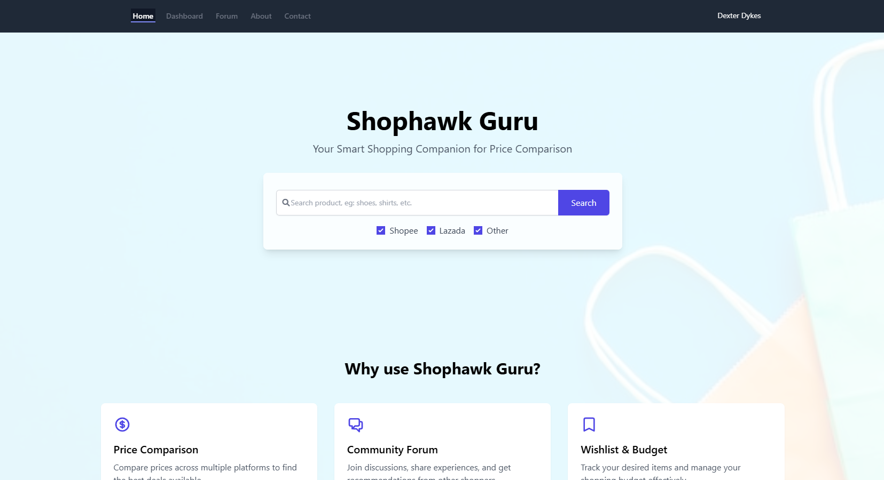

# ShopHawk

<div align="center">
  
</div>

## About ShopHawk

ShopHawk is a modern e-commerce platform built with Laravel and powered by cutting-edge web technologies. It provides a robust and scalable solution for searching online product through multiple e-commerse sites.

### Key Features

- 🛍️ Modern e-commerce platform
- 🎨 Sleek UI with Tailwind CSS
- ⚡ Fast and responsive with Vite
- 🛡️ Secure authentication system
- 📱 Mobile-friendly design
- 🔍 Advanced product search

## Tech Stack

- **Backend:** Laravel 11
- **Frontend:** 
  - Tailwind CSS
  - Vite
  - JavaScript
- **Database:** MySQL

## Getting Started

### Prerequisites

- PHP >= 8.1
- Composer
- Node.js & NPM
- MySQL

### Installation

1. Clone the repository:
```bash
git clone https://github.com/DyDxdYdX/shophawk.git
cd shophawk
```

2. Install PHP dependencies:
```bash
composer install
```

3. Install Node.js dependencies:
```bash
npm install
```

4. Create and configure your environment file:
```bash
cp .env.example .env
php artisan key:generate
```

5. Configure your database in the `.env` file

6. Run migrations:
```bash
php artisan migrate
```

7. Start the development server:
```bash
php artisan serve
```

8. In a separate terminal, start the Vite development server:
```bash
npm run dev
```

## License

This project is licensed under the MIT License - see the [LICENSE](LICENSE) file for details.

## Support

For support, please email [dydxsoft@gmail.com](mailto:dydxsoft@gmail.com) or open an issue in the GitHub repository.
